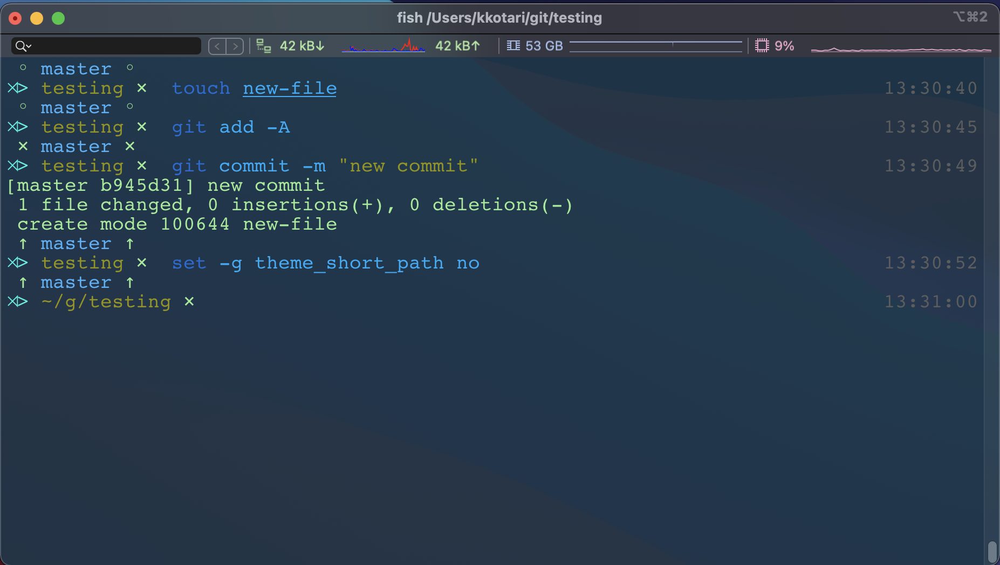

<div align="center">
  <a href="http://github.com/fish-shell/omf">
  
  </a>
</div>
<br>

> Default Git theme for [Oh My Fish][omf-link].

## Install

```fish
$ omf theme default-git
```

## Features

* All the things you need to know about Git in a glance.
* A subtle timestamp hanging out off to the right.
* Previous command status.

## Screenshot

<p align="center">

</p>

## Configuration

Only display the folder name:
```
  set -g theme_short_path yes
```

# License

[MIT][mit] © [kirankotari][author]  
This theme is derived from [default][default-link]


[mit]:            http://opensource.org/licenses/MIT
[author]:         http://github.com/kirankotari
[omf-link]:       https://www.github.com/fish-shell/oh-my-fish
[default-link]:   https://github.com/oh-my-fish/theme-default

